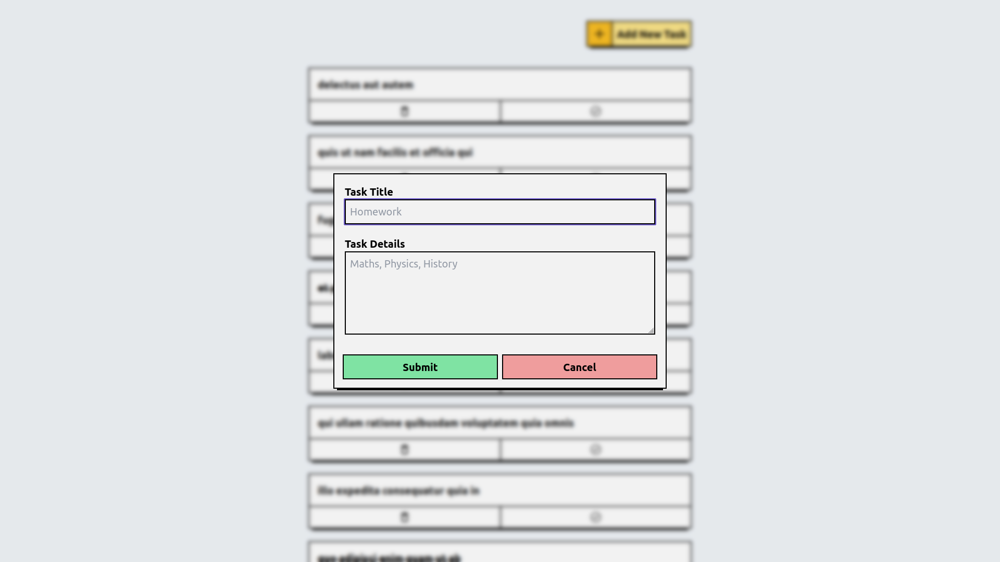

# Todo App
A Todo App built using React.js, Tailwind CSS, and Redux Toolkit fetches dummy data from [JSONPlaceholder](https://jsonplaceholder.typicode.com/) and displays it with custom components. It also allows users to add a new task, toggle task completion status, and delete a task.

## [Demo](https://todos.app3.in/)

## Features
- Add new task.
- Delete task.
- Toggle task completion status.

## Tech Stack
- Frontend: React.js, Tailwind CSS, React Redux, Redux Toolkit, Axios

## How to Setup Locally
1. Clone the repository.
    ```
    https://github.com/akashvaghela09/amasa-tech-todos.git
    ```
2. Navigate to the project directory and install the dependencies.
    ```
    cd amasa-tech-todos && npm install
    ```
3. Start the development server.
    ```
    npm start
    ```

## Screenshots

### 1. Homepage


### 2. Add New Task


## Acknowledgements
- [JsonPlaceHolder](https://jsonplaceholder.typicode.com/)

## Contributors
- [Akash Vaghela](https://linkedin.com/in/akashvaghela09/)
